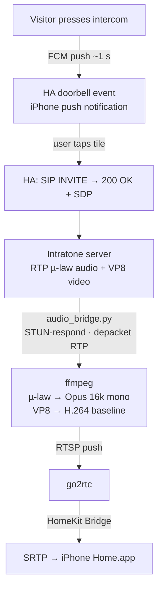

# Intratone Doorbell — Home Assistant integration

Native Home Assistant integration for the **Intratone** intercom system (manufactured by Cogelec, widely deployed in French apartment buildings). Exposes your apartment intercom as native HA entities and as a HomeKit accessory so calls ring directly on your iPhone, with one-way audio + video and a door-unlock button. It also exposes Intratone's *Clé mobile* / **mobipass** remote-open accesses as lock entities, so you can open your building's gate **on demand without anyone ringing** — including hands-free via a voice assistant.

[](https://my.home-assistant.io/redirect/hacs_repository/?owner=GuiHash&repository=ha-intratone&category=integration)

## Features

After pairing, the integration creates these entities under one device:

| Entity | What you can do |
|---|---|
| `event.intratone_<ID>_doorbell` | Fires every time a visitor rings the intercom. Payload includes `door_name`, `door_number` (NBPORTE), `caller`, `call_id`. Usable as automation trigger. |
| `camera.intratone_<ID>_intercom` | Placeholder image when idle. Live audio + video stream during a call. **Only created when the *Enable video (VP8)* option is on** (asked at pairing, changeable in the integration options). |
| `lock.intratone_<ID>_door` | Tap *Unlock* → opens the door (sends `opendoor:<code>` SIP MESSAGE, same backend as the official Intratone app). Only works **during an active call** (see Caveats). |
| `lock.intratone_<ID>_<access>` | One per **data-openable** access — Intratone's *Clé mobile* / **mobipass** (`data`/4G) and `ble` accesses. Tap *Unlock* to open that gate/door **on demand, no visitor needed** (`POST /api/access/open/clemobil`). Created at setup from `GET /api/access` (one per residence × door). Voice-assistant & HomeKit friendly for hands-free opening. **Legacy 2G `clemobil` accesses are not exposed** — the app opens those by placing a real phone call, which HA can't do. Absent if your account has no data-openable accesses, or until you [transfer the *Clé mobile* to HA](#transferring-the-clé-mobile-to-home-assistant) (single-owner since mid-2026). |
| `switch.intratone_<ID>_backlight` | Toggle ON during an active call to ask the intercom hardware for its backlight / illuminator mode (low-light conditions). One-shot — the server resets it on call end. Some hardware models don't support it; in that case the signal is silently ignored. **Only created when the *Enable video (VP8)* option is on** (it illuminates the visitor for the camera). |
| `binary_sensor.intratone_<ID>_push_channel_connected` | Diagnostic — `on` while the FCM push channel is up. If it goes `off`, you won't be notified of rings. |

Exposed to HomeKit via HA's HomeKit Bridge, the camera tile on iPhone Home.app delivers:

- Doorbell push notification < 2 s after a visitor rings (FCM)
- One-way audio (visitor → iPhone): G.711 µ-law transcoded to Opus on the fly
- Video (VP8 → H.264 baseline transcoding) — **opt-in** via the integration options (⚙️). Enable only if your Intratone subscription includes the visiophone (intercom with actual camera).
- Lock tile to open the door

## How it works



The FCM listener stays connected for the lifetime of the integration and reconnects with exponential backoff on failure. The SIP dialog opens only when the user actually taps the camera tile or the lock — mirrors the Cogelec app, which doesn't dial until you tap *Pick Up*. See [`INTRATONE_API.md`](INTRATONE_API.md) for the full REST + SIP reverse-engineering notes.

The integration also reacts to two additional FCM push types Cogelec emits:

- **`callCancel`** — the visitor walked away before any device picked up. We abort the in-flight SIP call (if any) and clear pending state so a subsequent tap on the iPhone tile doesn't open a stale stream. Apple's iOS doorbell notification itself can't be dismissed remotely — it will fade out on its own.
- **`unregister`** — the Intratone server invalidated our credentials (account reset, building operator unbound the device, …). HA's reauth flow is triggered; if the silent JWT refresh succeeds (it usually does as long as the phone/device_id are still on file), pairing continues seamlessly. Otherwise you'll see a Repair card asking for a new invitation code.

## Caveats

- **Intercom door unlock requires an active call.** `lock.intratone_<ID>_door` sends a SIP MESSAGE inside the active call dialog, so it only works in the **~25-second window** starting when the visitor presses the button and ending when the intercom hangs up. To open a gate/door **without anyone ringing**, use the remote-open access locks (*Clé mobile* / mobipass, `lock.intratone_<ID>_<access>`) instead — those work any time.
- **Audio quality**: bounded by G.711 µ-law @ 8 kHz (Intratone's wire codec). Some accounts receive only comfort-noise µ-law from the server during a call rather than the real microphone stream — same behaviour observed on the official Intratone iOS app for those accounts, only the GSM fallback carries real audio. Not a bug in this integration; it's a server / account-side condition.
- **Video quality**: bitrate is set by the intercom hardware (~5-10 kbps observed, ~2–5 fps). Equivalent quality to the official app — there's no client-side knob to request higher quality.
- **Video startup delay**: The Intratone server schedules VP8 keyframes infrequently. After tapping the HomeKit tile, expect a **5–15 second black screen** before video appears. This is not a bug — ffmpeg can't start encoding until it receives an I-frame from the server. If no video appears after ~20 s, see [Troubleshooting](#troubleshooting).
- **Camera entity is HomeKit-only**: `camera.intratone_<ID>_intercom` only delivers live video through the HomeKit + go2rtc path. Adding it to a Lovelace card or viewing it in Developer Tools → States will show "does not support play stream service" — this is expected.
- **France only**: tested against `sip.intratone.info`. Other Cogelec deployments untested.
- **Both devices ring in parallel.** The official Intratone app on your phone continues to receive rings alongside HA. Whichever device opens first triggers the relay; the other still rings.
- **The *Clé mobile* remote-open key is single-owner (since ~mid-2026).** Only one device per phone number can hold it, so the on-demand access locks live on either your phone **or** HA — not both. Ringing and in-call door unlock are unaffected. See [Transferring the *Clé mobile* to Home Assistant](#transferring-the-clé-mobile-to-home-assistant).

## Not yet implemented

- **Talkback** (iPhone microphone → visitor). The "Talk" button shows in HomeKit but does nothing. **Blocked on upstream**: Home Assistant's HomeKit Bridge and HAP-python don't expose camera microphone input at all today. We'll add it when one of them does.
- **Call history**, **multiple intercoms in one config entry**, **HomeKit Secure Video**.

## Prerequisites

1. **Home Assistant Core 2026.5.x** (the only version actually tested — older versions may work but YMMV).
2. **`ffmpeg`** binary available to HA, built with `libx264` and `libopus`. Pre-installed on HA OS and HA Container.
3. **HA's built-in HomeKit Bridge integration** configured (used to expose entities to iPhone Home.app).
4. **A reachable go2rtc instance** the integration can push its transcoded stream to. There are three common setups — pick whichever you already have, then point the integration at it (see [go2rtc setup](#go2rtc-setup)).
5. **Access to the official Intratone account** that's already paired to your apartment, on a phone where the Intratone app is logged in. You'll use that app to generate a one-time invite code for the HA pairing (see below).

## go2rtc setup

The integration pushes its transcoded RTSP stream (audio + optional VP8 video) to a go2rtc server and HA's HomeKit Bridge pulls from the same URL. You need go2rtc running, with a stream slot named `intratone` pre-declared (go2rtc rejects publishes on undeclared stream names).

There's no standalone "go2rtc" add-on in HA's default Add-on Store. Use one of:

### Option 1 — AlexxIT go2rtc add-on (recommended for HA OS)

The smallest dependency. Add a custom add-on repository:

1. **Settings → Add-ons → Add-on Store → ⋮ → Repositories**, add `https://github.com/AlexxIT/hassio-addons`
2. Install the **go2rtc** add-on
3. Configure it with the stream slot:
   ```yaml
   streams:
     intratone: ""
   ```
4. Start the add-on. It listens on `rtsp://127.0.0.1:8554` (no env var needed — this is the integration's default).

### Option 2 — Frigate add-on (if you already use Frigate for NVR)

Frigate bundles go2rtc on `127.0.0.1:8554`. Add to your `frigate.yaml`:

```yaml
go2rtc:
  streams:
    intratone: ""
```

### Option 3 — Own deployment (HA Core, Docker)

Run go2rtc binary or container yourself with:
```yaml
rtsp:
  listen: "127.0.0.1:8554"
streams:
  intratone: ""
```

If your go2rtc isn't on `127.0.0.1:8554`, change the **go2rtc RTSP relay URL** in the integration options (⚙️ on the Intratone integration card).

### Note on HA's embedded go2rtc (since 2024.x)

HA Core ships a bundled go2rtc binary that auto-starts in Docker / HA OS environments on port `18554`. Its config is HA-managed and **doesn't accept user `streams:` declarations**, so it can't accept our RTSP publish today. Use one of the options above instead.

## Installation

### Via HACS (custom repository)

Click the button below to open HACS directly on this integration:

[](https://my.home-assistant.io/redirect/hacs_repository/?owner=GuiHash&repository=ha-intratone&category=integration)

Or manually:

1. HACS → ⋮ menu → **Custom repositories**
2. Add `https://github.com/GuiHash/ha-intratone` with category **Integration**
3. Search **Intratone Doorbell** → Install
4. Restart Home Assistant

### Manual

The integration code lives at `custom_components/intratone/` **inside** the repo, so don't clone the repo directly into your `custom_components` folder — clone it elsewhere and copy (or symlink) the inner directory:

```bash
git clone https://github.com/GuiHash/ha-intratone.git /tmp/ha-intratone
cp -r /tmp/ha-intratone/custom_components/intratone <your HA config>/custom_components/intratone
# Or download a release archive and extract to custom_components/intratone/
```

## Pairing

In Home Assistant: **Settings → Devices & Services → Add Integration → Intratone Doorbell**. Pick one of two paths.

> **Which path should I pick?** If you want ring-free **remote opening** (the *Clé mobile* / CléMobil, exposed as `lock.intratone_<ID>_<access>`), use **Path B (invitation code)**. SMS pairing only ever gets you the doorbell and opening a door *during a call* — an SMS-registered device is never provisioned for the *Clé mobile* (see [issue #61](https://github.com/GuiHash/ha-intratone/issues/61)).

### Path A — SMS (doorbell only)

You'll be asked for your **phone number** (the one tied to your Intratone account) and the **country code** (default `33`). Intratone texts you a 4-digit code; type it on the next screen. Same flow as the official mobile app's first-time login. Mirrors `POST /api/auth/register` → `POST /api/auth/validate` → `POST /api/auth/device`.

> ⚠️ SMS pairing **cannot** enable the remote-open *Clé mobile*. If you want it, use Path B instead (you can remove and re-add the integration to switch).

### Path B — Invitation code (recommended for remote opening)

Generate an invite code from the **official Intratone app → Mes infos → Ajouter un appareil** (format `448789-1206`) and paste it. This is the method that provisions the device for the *Clé mobile* / remote opening; it's also the path for installer-managed accounts without a phone.

### After pairing

The integration registers an FCM push subscription and obtains a long-lived device JWT (rotated every 12 h). Both your existing phone and HA receive ring notifications in parallel; both can open the door.

If HA detects expired credentials it triggers a re-authentication flow that **silently** refreshes the JWT from the stored phone + device_id — you should not need to re-pair in normal use. The form only appears if the backend has unbound your device (rare, e.g. account reset on the Intratone side).

### Transferring the *Clé mobile* to Home Assistant

Since ~mid-2026 Intratone lets **only one device per phone number** hold the remote-open key (*Clé mobile* / **mobipass**). If the key currently lives on your phone (the usual case), the `lock.intratone_<ID>_<access>` entities won't appear — `GET /api/access` returns nothing until the key is moved to HA. See [issue #61](https://github.com/GuiHash/ha-intratone/issues/61).

> **Requires invitation-code pairing (Path B).** Only a device registered with an invitation code is provisioned for the *Clé mobile*; if you paired via SMS, the reconfigure step below will tell you to remove and re-add the integration with an invitation code first (issue #61).

To move it onto Home Assistant:

1. **Settings → Devices & Services → Intratone Doorbell → ⋮ → Reconfigure**.
2. Read the warning and confirm. Intratone texts a **one-time transfer code** to your account's phone number.
3. Enter the code. On success the access locks appear within a few seconds.

**This revokes on-demand remote opening in the official Intratone app on your phone** (only one device can hold it). Doorbell ringing and opening a door *during a call* (`lock.intratone_<ID>_door`) are unaffected on both devices — this only concerns the ring-free *Clé mobile* opening. To move the key back, redo the transfer from the official app.

## HomeKit Bridge configuration

Add to your `configuration.yaml`:

```yaml
homekit:
  - name: HA Bridge
    filter:
      include_entities:
        - camera.intratone_<ID>_intercom
        - event.intratone_<ID>_doorbell
        - lock.intratone_<ID>_door
        - lock.intratone_<ID>_<access>     # remote-open accesses (Clé mobile / mobipass), one per gate/door
        - switch.intratone_<ID>_backlight  # optional, only on hardware that supports it
    entity_config:
      camera.intratone_<ID>_intercom:
        support_audio: true
        linked_doorbell_sensor: event.intratone_<ID>_doorbell
        # HomeKit ffmpeg encodes Opus at 24 kbps with frame_duration 60 ms
        # → 180-byte frames. Default RTP packet size 188 (= 176 max payload)
        # rejects them, killing the audio output. Bump to fit + margin.
        audio_packet_size: 384
```

Replace `<ID>` by the suffix HA uses in your entity IDs — it derives from the config entry title, which is the phone number you paired with (e.g. `Intratone (+33612345678)` → `event.intratone_33612345678_doorbell`); it's visible in any of the entity names. Restart HA so the Bridge picks up the new config.

To opt into VP8 video, open the integration options (⚙️ on the Intratone card) and enable **Enable video (VP8)**.

## Recommended helpers

The integration intentionally only ships the entities listed above. Common observability needs (last ring time, count today, "currently ringing" flag, per-door routing) compose cleanly out of HA's built-in template helpers — pick what you actually need.

**Last ring timestamp.** No helper needed — `event.intratone_<ID>_doorbell` already exposes the timestamp of its last fire as its native state. Reference it directly in cards or templates:

```
{{ states('event.intratone_<ID>_doorbell') }}
```

**"Currently ringing" pulse.** Useful for HA conditions (`state: on`) or mobile notifications that want a stateful trigger. Add to `configuration.yaml`:

```yaml
template:
  - trigger:
      - platform: state
        entity_id: event.intratone_<ID>_doorbell
    binary_sensor:
      - name: Intratone ringing
        state: "on"
        auto_off: "00:00:08"   # match your intercom's ~8 s ring window
```

**Rings today (counter, resets at midnight).** No YAML — create a **History Statistics** helper from the UI: Settings → Devices & services → Helpers → "+ Create Helper" → History statistics. Pick `event.intratone_<ID>_doorbell` as entity, type *Count from start of day*, state-changes.

**Which door rang last (multi-door installs).** NBPORTE is in the event payload as `door_number`. A trigger-based template sensor captures it:

```yaml
template:
  - trigger:
      - platform: state
        entity_id: event.intratone_<ID>_doorbell
    sensor:
      - name: Intratone last door
        state: "{{ trigger.to_state.attributes.door_number }}"
```

You can also branch automations directly on `{{ trigger.event.data.door_number }}` inside a `platform: event` trigger on `event_type: state_changed` for the entity, if you don't need the value to persist as its own sensor.

## Troubleshooting

### Enabling debug logs

Add to `configuration.yaml` and restart HA:

```yaml
logger:
  logs:
    custom_components.intratone: debug
```

At `debug` level the integration logs every SIP message sent and received (TX/RX, credentials redacted), every FCM push received, and the exact ffmpeg command lines. Use these to diagnose ring delivery, audio, or video problems before opening an issue.

### Testing without a visitor: `intratone.simulate_ring`

The integration registers an `intratone.simulate_ring` service (Developer Tools → Actions) that injects a fake FCM ring payload into the coordinator, as if a visitor had pressed the button. By default it only fires the doorbell event (the fake `call_id` means the in-call door unlock would be rejected by the server). If you also set `sip_server_ip`, the **full call pipeline** fires — SIP INVITE → RTP → ffmpeg → go2rtc → HomeKit — which is designed for end-to-end testing against [`dev/mock_asterisk.py`](dev/mock_asterisk.py), a tiny mock SIP server that answers the INVITE and streams a 440 Hz sine over G.711 µ-law.

Main fields:

- `door_name` — human label carried in the event payload (default `PORTE TEST`)
- `call_id` — override the generated fake call id, for repeatable tests
- `entry_id` — target a specific config entry (defaults to all loaded entries)
- `sip_server_ip` — when set, triggers the real SIP flow against this IP (use `127.0.0.1` with the mock)
- `sip_target_user`, `sip_user`, `sip_pass` — SIP Request-URI user and Digest credentials for the mock flow

> The default SIP credentials in the schema (`cogelecTest` / `CogeleC`) are test values matching `dev/mock_asterisk.py` — they are not real Intratone credentials.

**Ring doesn't reach iPhone** — verify `event.intratone_<ID>_doorbell` fires in HA (Developer Tools → Events) when someone rings. Check the FCM listener heartbeat in logs (`firebase_messaging` lines every ~20 s). Make sure your HomeKit Bridge accessory is paired and the `linked_doorbell_sensor` is set. If rings **silently stopped after working fine**, Google may have rotated HA's FCM push token — Intratone keeps sending pushes to the old one. The integration detects this and raises a fixable Repair (**Settings → System → Repairs**) that asks for a fresh invitation code to re-register the new token.

**Tile opens but loading spinner forever** — go2rtc must be running with the `intratone` slot declared. Look for `FFMPEG_PUSH_READY: ... consumable` in HA logs (the marker confirming our ffmpeg pushed successfully); if absent, enable `custom_components.intratone: debug` and look for ffmpeg errors.

**Video enabled but tile loads forever or shows black** — `Error submitting packet to decoder: Invalid data found when processing input` (VP8) lines in the log are **expected at stream start**: they are P-frames arriving before the first I-frame and stop once ffmpeg decodes the keyframe. If `FFMPEG_PUSH_READY: timeout after 5.0s` appears, the Intratone server didn't send a VP8 keyframe within the window; tapping the tile again immediately usually succeeds on a second attempt.

**Tile opens but no audio** — look for `Packet size 180 too large` in HA's homekit ffmpeg logs. If present, the `audio_packet_size: 384` setting is missing from the HomeKit `entity_config` above. During a call, the `AUDIO_RX_SUMMARY` log line shows how many audio packets the integration received and whether their content was real audio or comfort-noise.

**Door doesn't open** — the unlock action only works during the active call dialog (see [Caveats](#caveats)). Open the camera tile first to trigger the call, then tap the lock within ~25 s.

**JWT expired** — auto-refreshed every 12 h. If HA detects an irrecoverable auth failure it triggers a re-authentication flow which silently mints a fresh JWT from the stored phone + device_id; the form only appears if the backend rejects that, in which case you'll need a new invite code from the official app.

## Privacy

The integration stores in the HA config entry:

- The **JWT** issued by Intratone (rotated every 12 h, or silently re-minted on auth failure).
- The **FCM credentials** handed back by Google's MCS (used to keep the push channel open across restarts).
- The **device id** generated locally during pairing (a random 16-character hex string, mimicking an Android `ANDROID_ID`).
- The **numeric account id** and **phone number** associated with the Intratone account that was paired.

No call history, audio, or video is persisted to disk by the integration — RTP frames are transcoded and forwarded to go2rtc/HomeKit in real time, then dropped.

**Settings → Devices & Services → Intratone Doorbell → ⋮ → Download diagnostics** produces a JSON dump for issue reports; phone number, JWT, FCM token + credentials, device id, numeric id and the caller SIP login are redacted automatically before download.

## Credits

Reverse-engineered from the official Cogelec / Intratone Android app (APK 4.6.3, plus the mobipass transfer flow from 4.6.4) and iOS app (IPA 4.4.10). HTTP, SIP and RTP behaviour mirrors what the official app does so the integration cohabits cleanly alongside it on the same account. See [`INTRATONE_API.md`](INTRATONE_API.md) for the full API notes, including the *Clé mobile* / mobipass remote-open and transfer endpoints.

## License

MIT.
